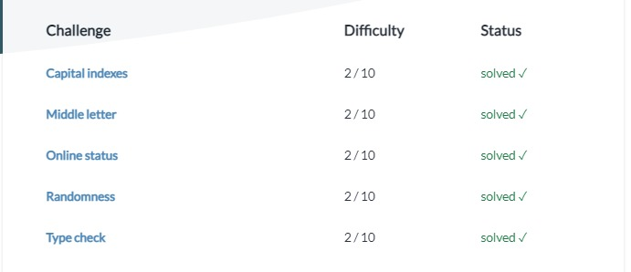

# Python In 7 Days

I am one a mission to learn python in 7 days. I will be covering all the concepts(basic-advanced) of python in these 7 days. The agenda of this 7-days is to see how much I can learn in this short amount of time.

### These are my learning resources so far

- [Youtube video - for visual learning](https://youtu.be/L5sZ6WgOnj0)
- [PythonPrinciples - for coding challenges](https://pythonprinciples.com/challenges/)
- [W3Schools - for references and docs](https://www.w3schools.com/python/)

## Day-1

I learnt some basics of python from the youtube video and did some practice's to make sure I have understood all the topic's properly.

## Day-2

I completed the python tutorial video. and did some simple problem solving's and felt a bit confident about it ��

